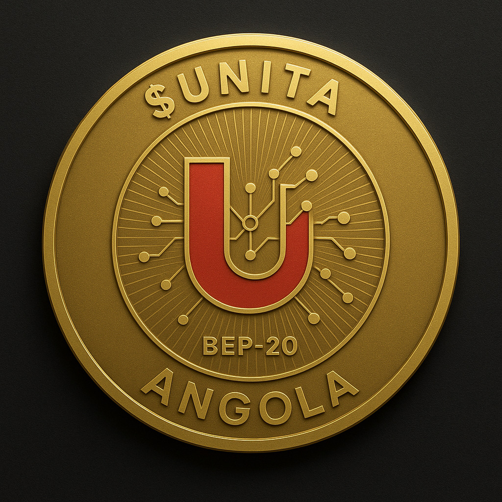

# $UNITA (UNITACoin)

  

**Quick Links:** [WHITEPAPER](./WHITEPAPER.md) | [MARKET ANALYSIS ](./MARKET_ANALYSIS.md) | [ROADMAP](./ROADMAP.md) | [BRANDING](./BRANDING.md) | [ANGOLA.md](./ANGOLA.md) | [CHANGELOG](./CHANGELOG.md)

UNITACoin ($UNITA) is a **BEP-20 community-driven digital utility token** for UNITA supporters worldwide. Designed to enable secure peer-to-peer transactions, staking rewards, LP incentives, and token-weighted governance, $UNITA fosters community engagement, value creation, and long-term sustainability. For full technical details and token mechanics, see the [WHITEPAPER](./WHITEPAPER.md).

----------

## 🚀 Features

-   **Secure Transactions:** Peer-to-peer transfers with blockchain security.
-   **Staking Rewards:** Holders earn rewards by staking $UNITA.
-   **Liquidity Pool Incentives:** Participate in liquidity pools for additional benefits.
-   **Governance:** Token-weighted governance empowers the community.
-   **Capped Supply:** 10 billion $UNITA maximum supply.
-   **Team Vesting:** Partial vesting to align incentives and long-term growth.
-   **Burn Limits:** Sustainable deflationary mechanism.
-   **Multi-Signature Security:** Ensures enterprise-grade protection for treasury and operations.

----------

## 💰 Tokenomics

| Allocation                  | Percentage |
|------------------------------|-----------|
| Community Allocation         | 40%       |
| Teams / Founder Allocation   | 25%       |
| Treasury / Development Fund  | 15%       |
| Partnership / Collaboration  | 10%       |
| Liquidity Pool / Exchange    | 10%       |

----------

## 🎨 Branding

-   **Official Token Image:** 
-   **Guidelines:** Refer to [BRANDING.md](./BRANDING.md) for full logo usage, color palette, typography, and visual identity standards.

### Logo Usage Examples

**✅ Do:**

-   Keep the logo in original colors.
-   Maintain clear space around the logo.
-   Use on clean, high-contrast backgrounds.

**❌ Don’t:**

-   Stretch, rotate, or distort the logo.
-   Change colors outside the official palette.
-   Place over busy backgrounds that reduce readability.

----------

## 🌐 Roadmap

1.  **Token Launch** – Smart contract deployment on BNB Smart Chain.
2.  **Community Building** – Engage supporters worldwide.
3.  **DEX & CEX Listings** – Listing on PancakeSwap, other DEX, and centralized exchanges.
4.  **Utility Expansion** – Enable staking, LP rewards, and governance voting.
5.  **Partnerships & Integrations** – Collaborate with fintech, SMEs, and infrastructure projects.
6.  **Global Adoption** – Encourage widespread $UNITA usage for digital transactions.

----------

## 🇦🇴 Angola Context

$UNITA can play a transformative role in Angola:

-   **Financial Inclusion:** Provide accessible digital payments where 68% of adults remain unbanked.
-   **Infrastructure Support:** Tokenize investments in major projects like Lobito Atlantic Railway.
-   **Economic Diversification:** Support SMEs, trade, and educational programs.
-   **Market Advantages:** Overcome limitations of local currency (Kwanza) and USD scarcity.

For full details, see [ANGOLA.md](./ANGOLA.md).

**Additional Market Analysis:** A detailed review of adoption potential, youth demographics, competitor landscape, regulatory context, technology access, behavioral insights, and projected economic benefits for $UNITA in Angola is available in [MARKET_ANALYSIS.md](./MARKET_ANALYSIS.md).

----------

## 📄 Disclaimer

$UNITA is a **community-driven utility token** and is **not endorsed or affiliated with the political party UNITA in Angola**. $UNITA is intended for digital transactions, staking, and community governance purposes only.

----------

## 🔧 Repository Structure

-   `UNITACoin.sol` – Smart contract implementation.
-   `WHITEPAPER.md` – Detailed technical whitepaper for $UNITA.
-   `ANGOLA.md` – Detailed economic context and $UNITA use case in Angola.
-   `MARKET_ANALYSIS.md` – Comprehensive market analysis and adoption strategy.
-   `AUDIT.me` – Certik-style audit analysis.
-   `ROADMAP.md` – Project roadmap.
-   `BRANDING.md` – Logo, color palette, typography, and visual identity guidelines.
-   `CHANGELOG.md` – Documenting version 1.0.0 release.
-   `.github/workflows/` – CI/CD workflows (linting, tests).
-   `README.md` – Project overview (this file).
-   `CONTRIBUTING.md` – Guidelines for contributing.
-   `SECURITY.md` – Security policies and reporting.
-   `CODE_OF_CONDUCT.md` – Community behavior standards.
-   `LICENSE.md` – Repository license.

----------

## 🤝 Contributing

We welcome contributions from the community. Please follow the [CONTRIBUTING.md](./CONTRIBUTING.md) guidelines to ensure smooth collaboration.

----------

## 📬 Contact

For inquiries and community support: [support@unitacoin.io](mailto:support@unitacoin.io)  
Website: [https://unitacoin.io](https://unitacoin.io)
